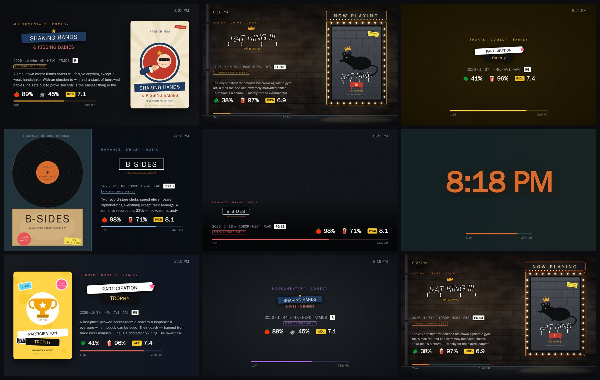
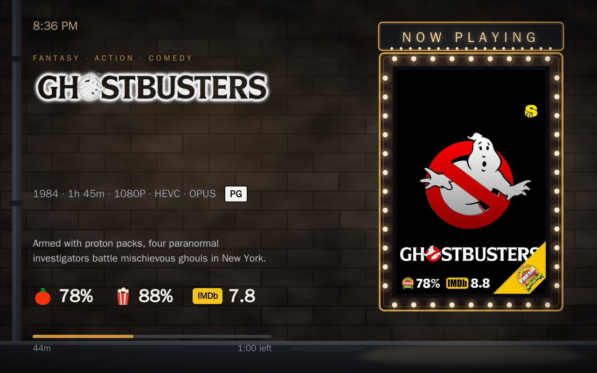
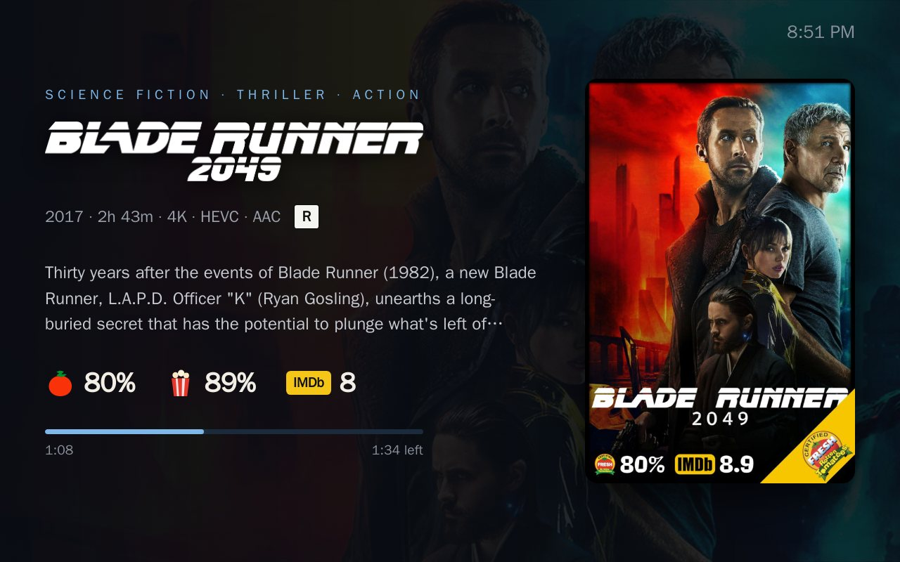
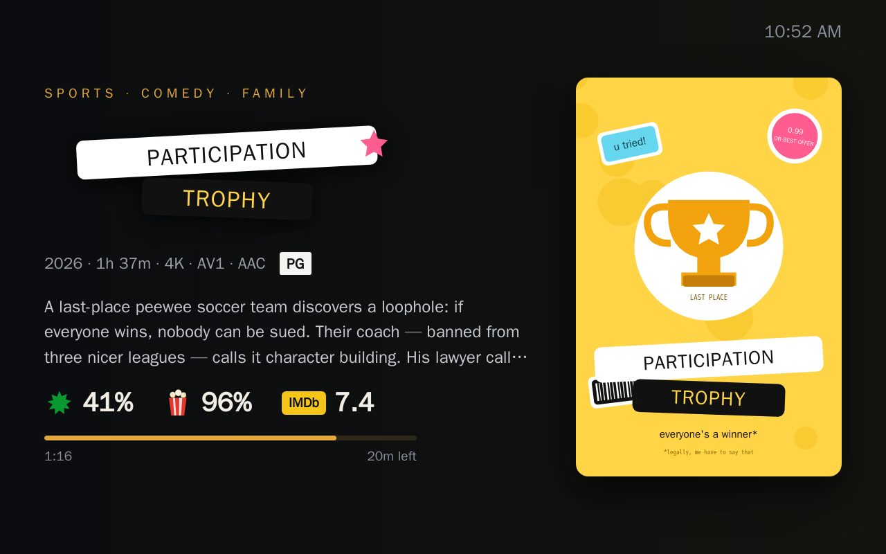
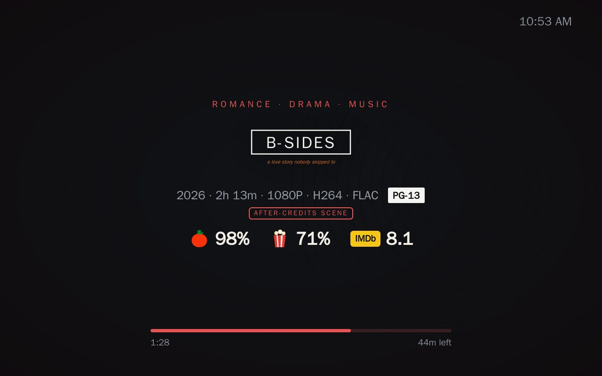
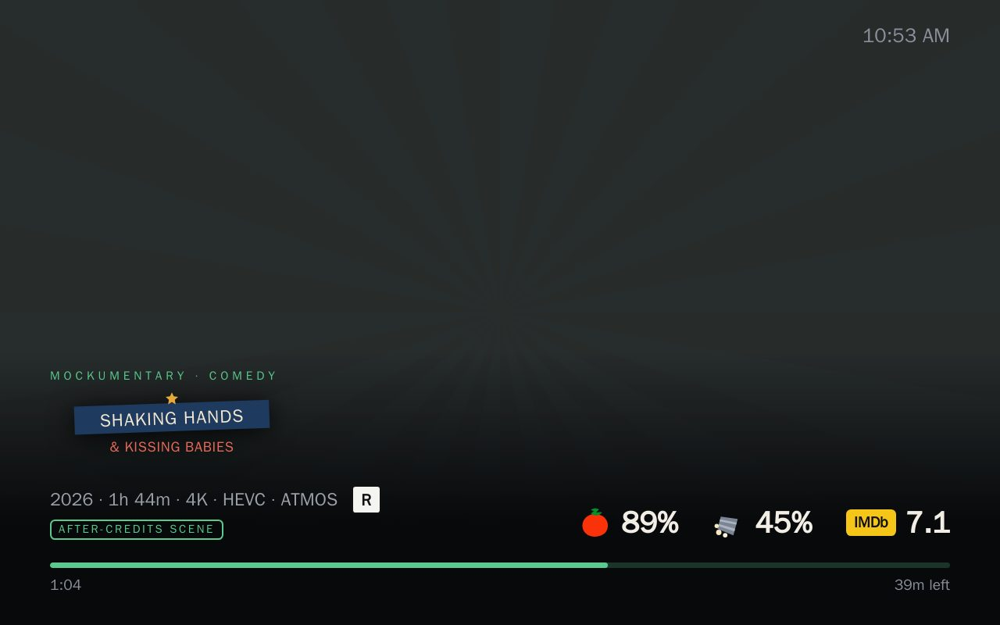
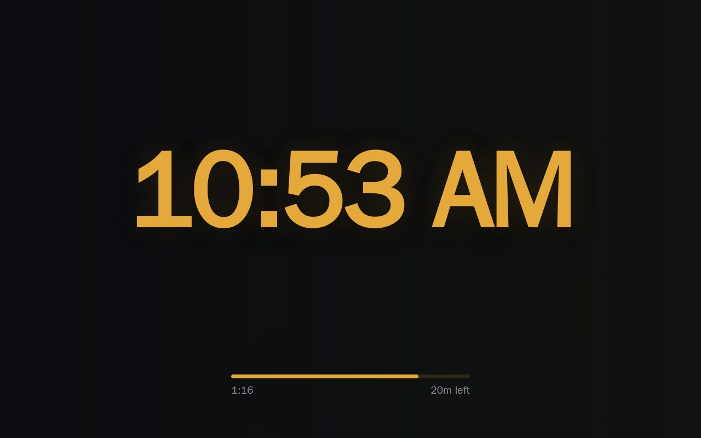
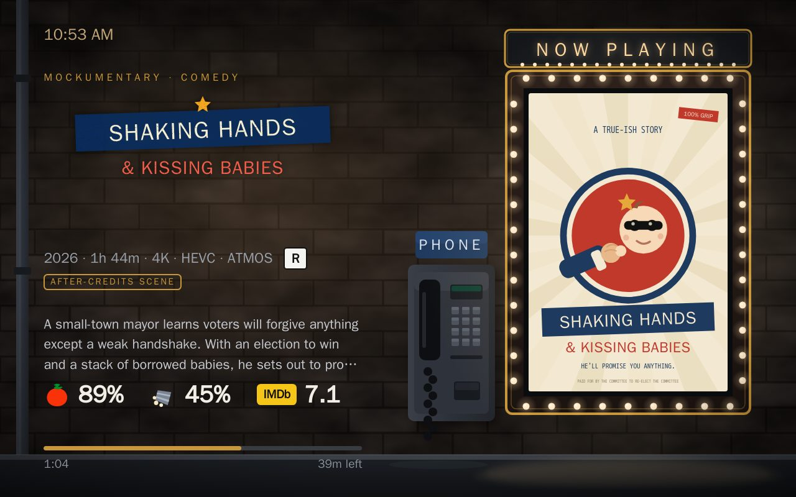
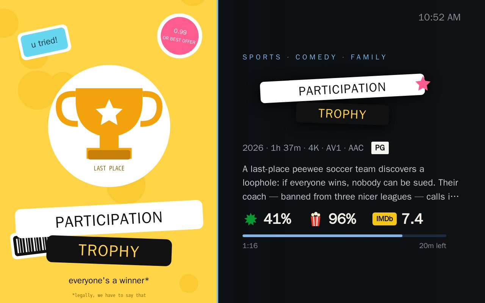
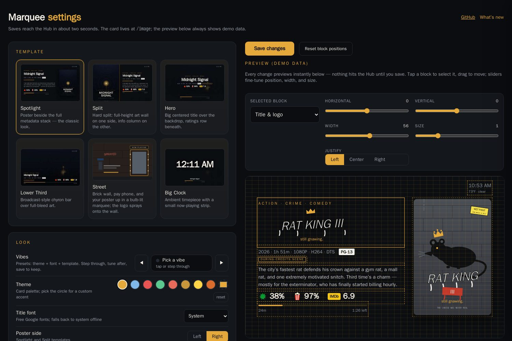

# Marquee

[](https://github.com/Jamisonfitz/marquee/actions/workflows/container.yml)
[](https://github.com/Jamisonfitz/marquee)
[](https://www.python.org/)
[](https://hub.docker.com/r/jamisonfitz/marquee)
[](https://hub.docker.com/r/jamisonfitz/marquee/tags)
[](LICENSE)

Marquee turns a Google Nest Hub into a clean Plex now-playing display. It shows artwork, title, plot, genres, ratings, media details, progress, and a clock, then returns the Hub to ambient mode when playback stops.



*Same app, nine looks: six templates × eight themes × six fonts × any accent color.*

With your own library it looks like this — real posters, backdrops, and clear-logos straight from Plex:

| | |
|:---:|:---:|
|  |  |

## Templates

Six designed layouts, switchable live from the settings page:

| | |
|:---:|:---:|
|  **Spotlight** — poster beside the full metadata stack |  **Hero** — big centered title over the backdrop |
|  **Lower Third** — broadcast-style chyron over full-bleed art |  **Big Clock** — ambient timepiece with a now-playing strip |
|  **Street** — a living night scene: your poster in a bulb-lit marquee, the movie logo sprayed on brick |  **Split** — hard split: full-height art wall beside the info column |

Every template is built from the same blocks — title/logo identity, grouped ratings, metadata chips, plot, progress, clock, poster — so your show/hide toggles, themes, custom accent color, and block position tweaks carry across all of them.



## Features

- Live Plex now-playing card with six designed templates: Spotlight, Split,
  Hero, Lower Third, Big Clock, and Street (animated marquee bulbs and all).
- Eight themes, one-tap Vibe presets, a custom accent color, five title
  fonts, 12/24-hour clock styles, and per-block show/hide toggles.
- Session filters: limit casting to your Plex users and your devices, live
  from the settings page — shared users no longer take over the display.
- A drag-and-slider editor for moving, sizing, justifying, and scaling each
  card block, with an instant demo preview featuring original fictional
  films (no copyrighted art).
- Persisted settings, health checks, and a Docker-first deployment path.
- Google Nest Hub casting with clean idle handoff back to ambient mode.

## What You Need

- Docker
- Plex Media Server on the same LAN
- A Google Nest Hub on the same LAN
- A Plex `X-Plex-Token`

Marquee is designed for a trusted LAN. It has no login and should not be port-forwarded.

## Quick Start

Edit the example IP addresses and token in `compose.yaml`, then run:

```sh
docker compose up -d --build
docker compose logs -f marquee
```

Open `http://SERVER-IP:8084/`. The card served to the Hub is `http://SERVER-IP:8084/image`.

If you prefer plain Docker:

```sh
docker build -t marquee:local .
docker run -d --name marquee --restart unless-stopped --network host \
  -e PAGE_URL=http://192.168.1.10:8084/image \
  -e PLEX_HOST=http://localhost:32400 \
  -e PLEX_TOKEN=replace-me \
  -v marquee-config:/config \
  marquee:local
```

Settings persist under `./data` in Compose mode or `/config` in the container.

## Configuration

Required environment variables:

- `PAGE_URL` — this server's LAN IP + `/image`. The Hub loads this URL, so
  `localhost` will not work here.
- `PLEX_HOST` — keep `http://localhost:32400` when Plex runs on the same
  machine; otherwise its LAN IP
- `PLEX_TOKEN`

Cast device: open the settings page and press **Scan** — Marquee discovers
Google Cast devices on your LAN and you pick your Hub from a dropdown.
(`HUB_IP` still works as an env fallback; discovery needs the container on
the same network/VLAN as the Hub, which host networking gives you.)

Optional settings:

- `PLEX_USERS` — comma-separated Plex usernames that trigger the marquee.
  Leave empty to react to everyone on the server, including shared and home
  users (the sessions API is server-wide).
- `PLEX_DEVICES` — comma-separated player/device names that trigger the
  marquee; empty allows any device. Both filters are also editable live on
  the settings page, which shows the exact names of active sessions.
- `TMDB_API_KEY`
- `POLL_SECONDS` default `5`
- `SERVE_PORT` default `8084`
- `REPO_DIR` — the container sets `/app` (the code's own default is `/repo`)
- `DATA_DIR` — the container sets `/config` (the code's own default is
  `REPO_DIR/output`)

### Env vars that the settings page can also set

Three settings exist in both places, and they combine differently:

| Setting | Env var | Settings page | How they combine |
|---|---|---|---|
| Cast device | `HUB_IP` | Cast device picker | The settings page **wins**; the env var is only a fallback for when no device has been picked. |
| Users | `PLEX_USERS` | Users | **Both apply.** The two lists are merged. |
| Devices | `PLEX_DEVICES` | Devices | **Both apply.** The two lists are merged. |

The merge is worth understanding before you use `PLEX_USERS` or `PLEX_DEVICES`.
The settings page can only **add** names to what the env var already allows — it
cannot remove them, and it does not display them. If `PLEX_USERS=jamison` is set
in your Compose file, the Users field on the settings page shows up *empty*, as
though nobody were being filtered, while every session except `jamison`'s is
silently ignored. Clearing the field changes nothing.

If you want to manage the filters from the settings page, leave `PLEX_USERS` and
`PLEX_DEVICES` unset. Use them only for a filter you want pinned at the
container level, where nobody can lift it from the UI.

Health status is available at `/healthz` and includes the version.

## Plex Token

1. Sign in to Plex Web and open an item on your server.
2. Select **More (`…`) → Get Info → View XML**.
3. Copy the value after `X-Plex-Token=` from the browser address bar.
4. Test it at `http://PLEX-IP:32400/?X-Plex-Token=YOUR_TOKEN`.

See Plex's [token instructions](https://support.plex.tv/articles/204059436-finding-an-authentication-token-x-plex-token/).
Never put a real token in Compose files, screenshots, issues, or commits.

For credits-scene badges, create a TMDb account, open **Account Settings → API**, request a key, and set `TMDB_API_KEY`.

## Tips

**Silence the cast chime.** Every time Marquee takes over the display, the
Nest Hub plays its connect sound. That chime comes from the device, not from
Marquee, and there's a switch for it: open the **Google Home** app → tap
your Hub → **Settings (gear) → Accessibility** → turn off **Play sounds on
start/end of casting**. One-time change; casting is silent afterwards.

## Community Forks & Related Projects

- [TRusselo's fork](https://github.com/TRusselo/marquee) — exploring Emby
  support, ESP32/ESPHome displays, Home Assistant integration, and vertical
  poster views. Independent project, not maintained or supported here, but
  worth a look if that's your stack.

## Development

```sh
docker build -t marquee:test .
docker run --rm marquee:test python cast/cast.py --selftest
docker logs -f marquee
```

The service uses [catt](https://github.com/skorokithakis/catt) to launch DashCast on the Hub. Ratings come from Plex metadata; optional credits-scene keywords come from TMDb.

### Cast behavior

Marquee checks that DashCast is active, casts the `/image` URL when playback starts, and releases the Hub when playback stops. Container tests cannot prove physical Hub behavior, so before publishing a release:

1. Open `PAGE_URL` from another LAN device.
2. Start a Plex movie or episode and confirm the Hub loads the card.
3. Pause and resume playback and confirm the progress state updates within one poll interval.
4. Stop playback and confirm the Hub returns to ambient mode.
5. Review `docker logs marquee`; there should be no `catt ... failed` message.
